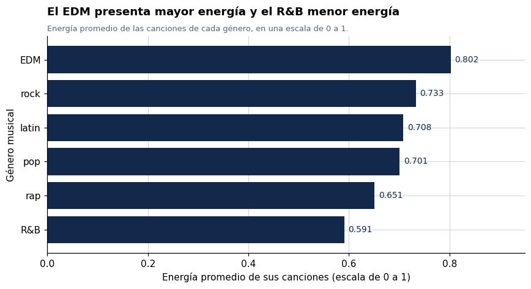
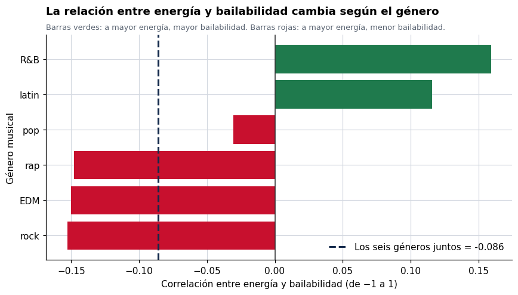

# s100-tareas
# Problem Set 1 — ¿Qué distingue a un género musical?


## Contenido

- [Dataset](#dataset)
- [Proceso](#proceso)
- [Hallazgos principales](#hallazgos-principales)
- [Herramientas](#herramientas)
- [Estructura del repositorio](#estructura-del-repositorio)

**Pregunta:** ¿en qué se diferencian seis géneros musicales según las características de audio de sus canciones, y sirven esas características para explicar por qué una canción se vuelve popular?

**Resultado en una frase:** los géneros se diferencian con claridad en energía (EDM 0.802 frente a R&B 0.591) y en qué tan parecidas son sus canciones entre sí, pero ninguna de las diez características de audio explica más del 2.2% de la popularidad, y la relación entre energía y bailabilidad se invierte según el género.

Problem Set 1 del curso S100 · Introducción a la Ciencia de Datos, Maestría en Analítica de Datos (UTP). Cinco ejercicios encadenados sobre 32,833 canciones de Spotify: exploración inicial, resumen de una variable, comparación entre grupos, matriz de correlación, y correlación por subgrupo con estandarización.

---

## Dataset

**Spotify Songs** — 32,833 canciones, 23 columnas, 6 géneros (EDM, latin, pop, R&B, rap, rock). Incluye 10 características de audio calculadas por Spotify (`danceability`, `energy`, `loudness`, `speechiness`, `acousticness`, `instrumentalness`, `liveness`, `valence`, `tempo`, `duration_ms`) y la popularidad de cada canción en una escala de 0 a 100.

> Datos recolectados con el paquete [`spotifyr`](https://www.rcharlie.com/spotifyr/) desde la API de Spotify y publicados en [TidyTuesday, 21 de enero de 2020](https://github.com/rfordatascience/tidytuesday/tree/master/data/2020/2020-01-21). La selección original de ~5,000 canciones por género es de Kaylin Pavlik.

## Proceso

1. **Exploración inicial**: estructura de la tabla, resumen estadístico, conteo por género y revisión de valores faltantes (5 filas sin nombre de canción; ninguna variable de audio incompleta).
2. **Resumen de una variable**: media, mediana, desviación estándar, rango y asimetría de `energy`, con histograma.
3. **Comparación entre géneros**: media y desviación estándar de `energy` por género, con gráfico de barras y boxplot.
4. **Relaciones entre variables**: matriz de correlación de las 10 variables de audio, los 45 pares únicos ordenados, diagrama de dispersión del par más fuerte, y correlación de cada variable con la popularidad.
5. **Correlación por subgrupo**: la misma correlación calculada dentro de cada género, tabla resumen comparativa y estandarización de `energy` para identificar el caso extremo.

## Hallazgos principales



- **El EDM presenta la mayor energía promedio (0.802) y el R&B la menor (0.591).** La diferencia de 0.211 puntos supera una desviación estándar completa de la variable.
- **El rock es el género más variado internamente** (desviación estándar 0.195), mientras que el EDM es el más homogéneo (0.139). El promedio representa bien al EDM y mal al rock.
- **El par de variables más correlacionado es `energy` con `loudness` (r = 0.677)**, y el más negativo es `acousticness` con `energy` (r = −0.540). El resto de los 45 pares se mantiene por debajo de 0.20 en valor absoluto.
- **La popularidad casi no depende del audio.** La variable más relacionada es `instrumentalness` (r = −0.150), que explica apenas el 2.2% de la variación. El género más enérgico, EDM, es además el menos popular (34.8 frente a 47.7 del pop).



- **La correlación global entre `energy` y `danceability` es de −0.086, casi cero, pero es un promedio engañoso.** Dentro de rock (−0.153), EDM (−0.150) y rap (−0.148) la relación es negativa; dentro de R&B (0.159) y latin (0.116) es positiva. Los signos contrarios se cancelan al juntar los seis géneros: un caso de paradoja de Simpson, donde el género actúa como variable oculta.

## Herramientas

Python (pandas, NumPy) · Matplotlib · Jupyter Notebook

## Estructura del repositorio

```
├── README.md
├── S100_PS1_Karina_Correa.ipynb    # Notebook completo (5 ejercicios + párrafo de cierre)
├── spotify_songs.csv               # Dataset original (TidyTuesday 2020-01-21)
└── results/                        # Gráficos exportados del notebook
    ├── ps1_01_histograma_energia.png
    ├── ps1_02_energia_por_genero.png
    ├── ps1_03_boxplot_genero.png
    ├── ps1_04_energia_vs_volumen.png
    └── ps1_05_correlacion_por_genero.png
```

El notebook corre de principio a fin con `spotify_songs.csv` en la misma carpeta.

## Autora

Karina Correa — [LinkedIn](https://linkedin.com/in/karina-correa-aparicio) · [GitHub](https://github.com/KARCOR)
